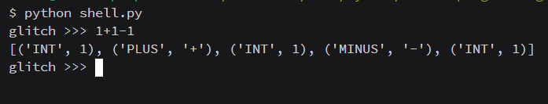
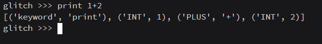
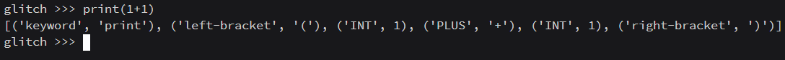

# Glitch ⚡️🐛

> Don't be scared of bugs. Embrace the bug. Become the bug

## How to start?

#### In the glitch directory run

```
  python shell.py
```

To end the process

```
  exit()
```

## Tokens

#### Operations

```
 + - * /
```

#### Symbols

```
 ( ) ,
```

#### Keywords

```
 print
```

### Examples






